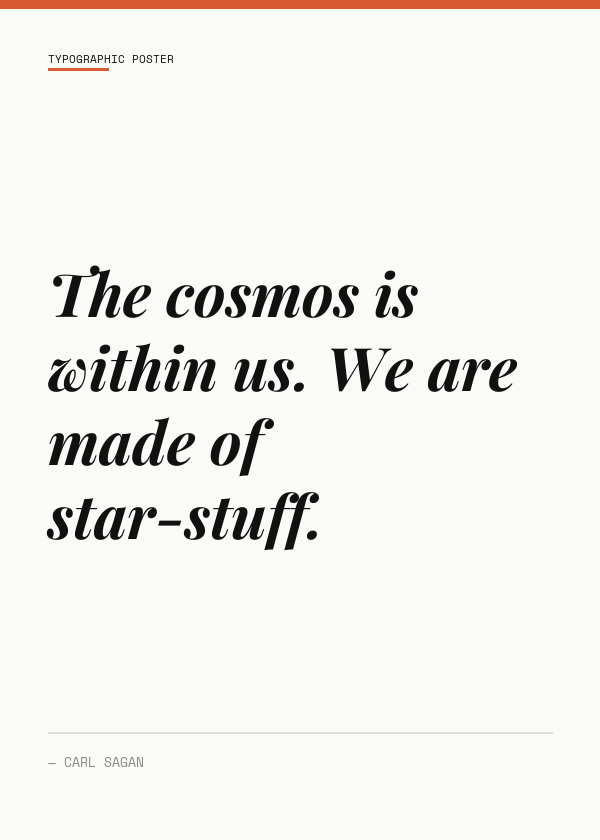
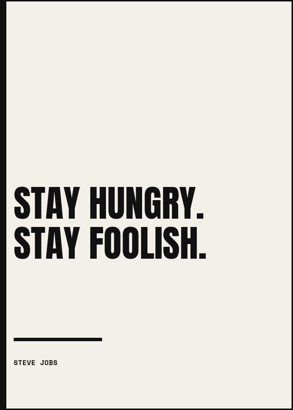
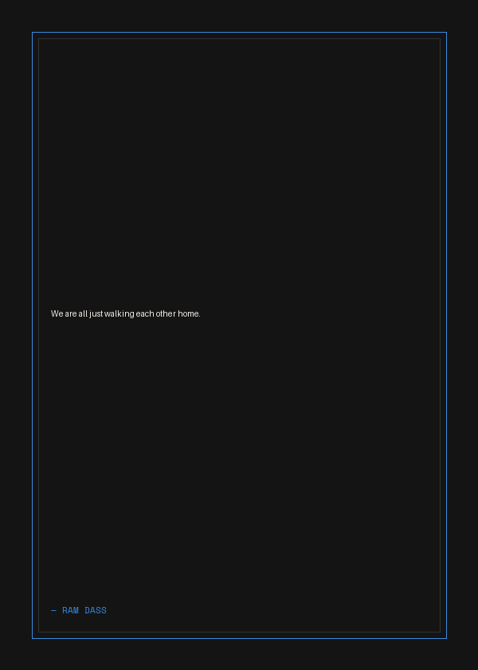
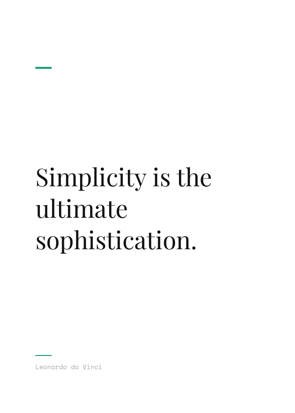
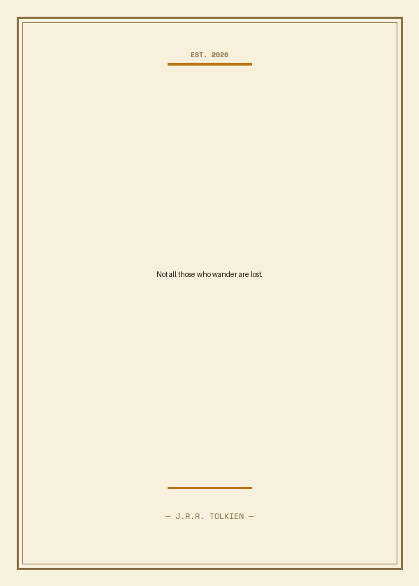
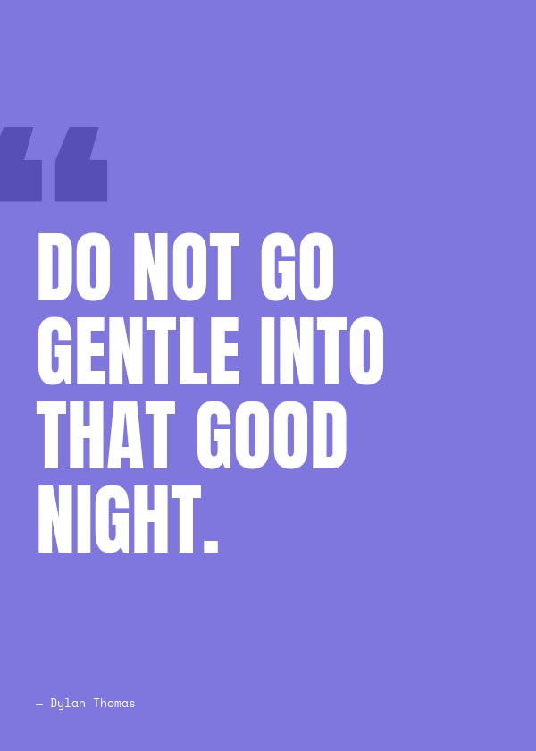

# 🖋️ Typographic Poster Machine

> Turn any quote into a print-ready typographic poster — straight from the command line.

Built with Python + Pillow. Six visual styles, seven accent colors, zero design skills required.

---

## Examples

| Editorial | Brutalist | Noir |
|-----------|-----------|------|
|  |  |  |

| Minimal | Vintage | Bold |
|---------|---------|------|
|  |  |  |

---

## Setup

```bash
git clone https://github.com/PJ-Cipher/Typographic-Poster-Machine
cd Typographic-Poster-Machine
pip install -r requirements.txt
```

Then download the required fonts from Google Fonts and place the `.ttf` files in the `fonts/` folder:

| Font | Used in |
|------|---------|
| [Playfair Display](https://fonts.google.com/specimen/Playfair+Display) | Editorial, Minimal |
| [Space Mono](https://fonts.google.com/specimen/Space+Mono) | All styles (labels) |
| [Cormorant Garamond](https://fonts.google.com/specimen/Cormorant+Garamond) | Noir, Vintage |
| [Anton](https://fonts.google.com/specimen/Anton) | Brutalist, Bold |

---

## Usage

```bash
python poster.py "Your quote here" --author "Author Name" --style editorial --color coral
```

Output is saved as `poster.png` by default. Open it with any image viewer.

### Randomise everything

```bash
python poster.py "Not all those who wander are lost." --style random --color purple
```

---

## Options

| Flag | Values | Default |
|------|--------|---------|
| `--style` | `editorial` `brutalist` `noir` `minimal` `vintage` `bold` `random` | `editorial` |
| `--color` | `coral` `blue` `teal` `pink` `amber` `purple` `black` or any `#hex` | `coral` |
| `--author` | Any string | *(none)* |
| `--output` | `filename.png` | `poster.png` |

---

## Styles

| Style | Vibe |
|-------|------|
| `editorial` | Serif italic, ruled lines, magazine layout |
| `brutalist` | Heavy caps, raw borders, thick geometry |
| `noir` | Dark background, delicate border, moody type |
| `minimal` | White space, hairline accents, quiet elegance |
| `vintage` | Warm cream, decorative frame, centered serif |
| `bold` | Full-bleed color, giant white caps |

---

## Project Structure

typographic-poster/
├── poster.py          # CLI entry point
├── utils.py           # Text wrapping + color helpers
├── styles/
│   ├── init.py    # Style registry
│   ├── editorial.py
│   ├── brutalist.py
│   ├── noir.py
│   ├── minimal.py
│   ├── vintage.py
│   └── bold.py
├── fonts/             # .ttf files (download separately)
├── examples/          # Sample outputs
└── requirements.txt


---

## Generate All Examples

```bash
chmod +x generate_examples.sh
./generate_examples.sh
```

---

## Requirements

- Python 3.8+
- Pillow

---

*Made with Python. Inspired by print design.*
